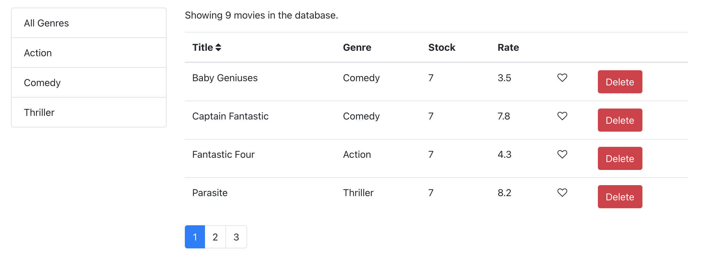
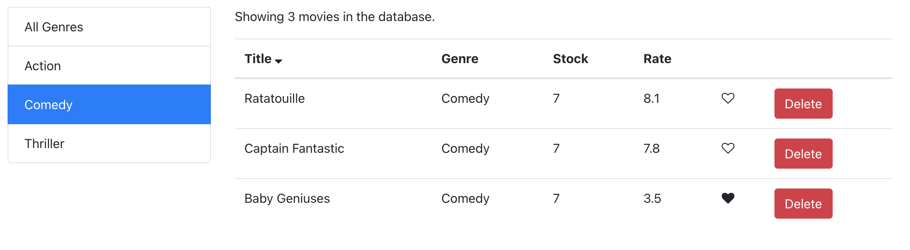
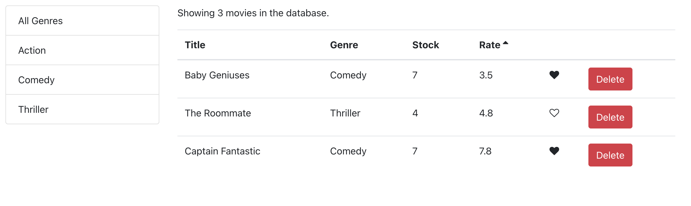

# Movies smart list

This simple project is rendering a predefined list of movies with pagination. You can filter the list by genres, sort, like,and delete items.

In this screen you can see how the main page looks.

You can filter by genre.

Also, you can delete or like movies in the list.

---

If you would like to run the project, you can go to the base directory of this project.

`cd movies`

After that, you can Run the app in the development mode.

`npm start`
